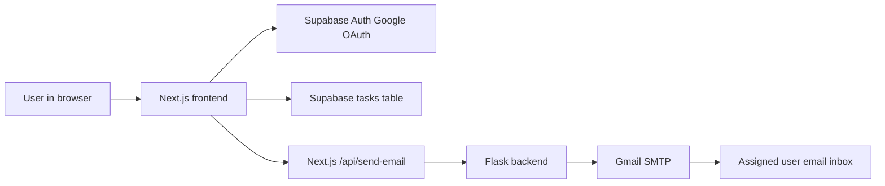

# Hairdrama Task Manager

A simple task management app built for the Hairdrama Tech internship assignment. Users can sign in with Google, create tasks, assign them by email, mark tasks as completed, and receive Gmail notifications for task creation and completion.

## Tech Stack

- Frontend: Next.js, TypeScript, Tailwind CSS
- Backend: Flask, Flask-Mail
- Database: Supabase
- Authentication: Google OAuth through Supabase Auth
- Email: Gmail SMTP using an app password
- Deployment: Vercel for frontend, Render or Railway for backend

## Architecture



## Features

- Google login with Gmail accounts
- Create tasks with title, description, and assigned email
- View tasks assigned to the logged-in user
- Mark pending tasks as completed
- Email notification when a task is assigned
- Email notification when a task is completed
- Responsive task grid with 1, 2, or 3 columns depending on screen size

## Project Structure

```text
backend/
  app.py                Flask API and Gmail email routes
  requirements.txt      Python dependencies
frontend/
  app/page.tsx          Main task manager UI
  app/api/send-email/   Next.js API route that forwards email requests
  src/lib/supabase.ts   Supabase client setup
migrations/
  001_create_tasks.sql  Supabase table and RLS policies
.env.example            Required environment variables
```

## Local Setup

1. Create a Supabase project.
2. Run `migrations/001_create_tasks.sql` in the Supabase SQL editor.
3. Enable Google provider in Supabase Auth.
4. Copy `.env.example` values into:
   - `frontend/.env.local` for frontend variables
   - `backend/.env` for Gmail variables

Frontend:

```powershell
cd frontend
npm install
npm run dev
```

Backend:

```powershell
cd backend
pip install -r requirements.txt
python app.py
```

Open the app at:

```text
http://127.0.0.1:3000
```

## Environment Variables

Frontend:

```text
NEXT_PUBLIC_SUPABASE_URL=
NEXT_PUBLIC_SUPABASE_ANON_KEY=
NEXT_PUBLIC_BACKEND_URL=http://127.0.0.1:5000
```

Backend:

```text
GMAIL_USER=
GMAIL_APP_PASSWORD=
```

For production, set `NEXT_PUBLIC_BACKEND_URL` to the deployed backend URL.

## Deployment Notes

- Deploy the frontend folder to Vercel.
- Deploy the backend folder to Render or Railway.
- Add the same environment variables in the deployment dashboards.
- In Supabase, add the deployed frontend URL to the Auth redirect URLs.
- Gmail must use an app password, not the normal Gmail password.

## Code Explanation Points

- `frontend/src/lib/supabase.ts` creates the Supabase client from environment variables.
- `frontend/app/page.tsx` handles login, task creation, task listing, completion, and UI state.
- `frontend/app/api/send-email/route.ts` keeps backend email calls on the server side.
- `backend/app.py` receives email payloads and sends Gmail messages through Flask-Mail.
- `migrations/001_create_tasks.sql` defines the database table and basic row-level security policies.
